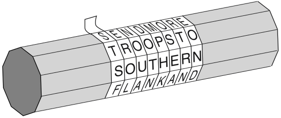
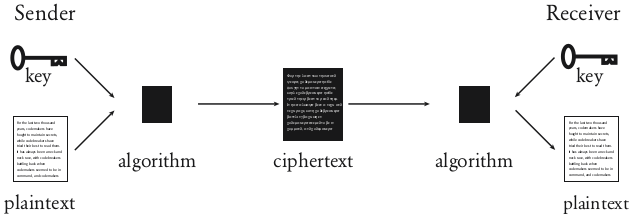
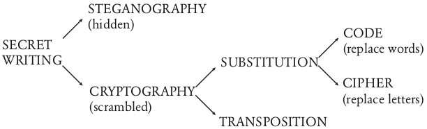
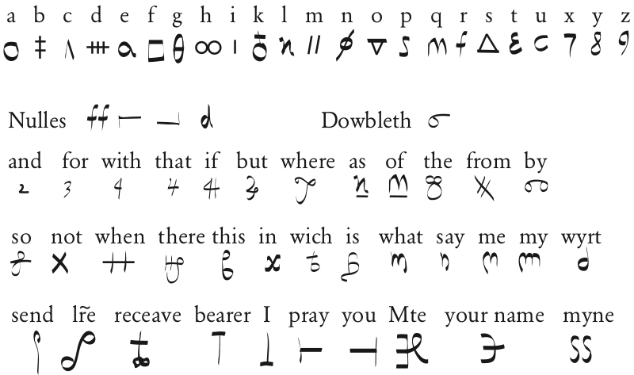
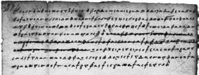
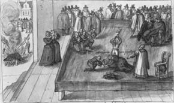

## CHAPTER 1 The Cipher of Mary Queen of Scots
The birth of cryptography, the substitution cipher and the invention of codebreaking by frequency analysis

On the morning of Saturday, October 15, 1586, Queen Mary entered the crowded courtroom at Fotheringhay Castle. Years of imprisonment and the onset of rheumatism had taken their toll, yet she remained dignified, composed and indisputably regal. Assisted by her physician, she made her way past the judges, officials and spectators, and approached the throne that stood halfway along the long, narrow chamber. Mary had assumed that the throne was a gesture of respect toward her, but she was mistaken. The throne symbolized the absent Queen Elizabeth, Mary’s enemy and prosecutor. Mary was gently guided away from the throne and toward the opposite side of the room, to the defendant’s seat, a crimson velvet chair. 


**Figure 1** Mary Queen of Scots.

Mary Queen of Scots was on trial for treason. She had been accused of plotting to assassinate Queen Elizabeth in order to take the English crown for herself. Sir Francis Walsingham, Elizabeth’s principal secretary, had already arrested the other conspirators, extracted confessions and executed them. Now he planned to prove that Mary was at the heart of the plot, and was therefore equally to blame and equally deserving of death. 

Walsingham knew that before he could have Mary executed, he would have to convince Queen Elizabeth of her guilt. Although Elizabeth despised Mary, she had several reasons for being reluctant to see her put to death. First, Mary was a Scottish queen, and many questioned whether an English court had the authority to execute a foreign head of state. Second, executing Mary might establish an awkward precedent—if the state is allowed to kill one queen, then perhaps rebels might have fewer reservations about killing another, namely Elizabeth. Third, Elizabeth and Mary were cousins, and their blood tie made Elizabeth all the more squeamish about ordering the execution. In short, Elizabeth would sanction Mary’s execution only if Walsingham could prove beyond any hint of doubt that she had been part of the assassination plot.

The conspirators were a group of young English Catholic noblemen intent on removing Elizabeth, a Protestant, and replacing her with Mary, a fellow Catholic. It was apparent to the court that Mary was a figurehead for the conspirators, but it was not clear that she had given her blessing to the conspiracy. In fact, Mary had authorized the plot. The challenge for Walsingham was to demonstrate a clear link between Mary and the plotters.

On the morning of her trial, Mary sat alone in the dock, dressed in sorrowful black velvet. In cases of treason, the accused was forbidden counsel and was not permitted to call witnesses. Mary was not even allowed secretaries to help her prepare her case. However, her plight was not hopeless, because she had been careful to ensure that all her correspondence with the conspirators had been written in cipher. The cipher turned her words into a meaningless series of symbols, and Mary believed that even if Walsingham had captured the letters, he could have no idea of the meaning of the words within them. If their contents were a mystery, then the letters could not be used as evidence against her. However, this all depended on the assumption that her cipher had not been broken. 

Unfortunately for Mary, Walsingham was not merely principal secretary, but also England’s spymaster. He had intercepted Mary’s letters to the plotters, and he knew exactly who might be capable of deciphering them. Thomas Phelippes was the nation’s foremost expert on breaking codes, and for years he had been deciphering the messages of those who plotted against Queen Elizabeth, thereby providing the evidence needed to condemn them. If he could decipher the incriminating letters between Mary and the conspirators, then her death would be inevitable. On the other hand, if Mary’s cipher was strong enough to conceal her secrets, then there was a chance that she might survive. Not for the first time, a life hung on the strength of a cipher. 

### THE EVOLUTION OF SECRET WRITING

Some of the earliest accounts of secret writing date back to Herodotus—“the father of history,” according to the Roman philosopher and statesman Cicero. In The Histories, Herodotus chronicled the conflicts between Greece and Persia in the fifth century B.C., which he viewed as a confrontation between freedom and slavery, between the independent Greek states and the oppressive Persians. According to Herodotus, it was the art of secret writing that saved Greece from being conquered by Xerxes, the despotic leader of the Persians. 

The long-running feud between Greece and Persia reached a crisis soon after Xerxes began constructing a city at Persepolis, the new capital for his kingdom. Tributes and gifts arrived from all over the empire and neighboring states, with the notable exceptions of Athens and Sparta. Determined to avenge this insolence, Xerxes began mobilizing a force, declaring that “we shall extend the empire of Persia such that its boundaries will be God’s own sky, so the sun will not look down upon any land beyond the boundaries of what is our own.” He spent the next five years secretly assembling the greatest fighting force in history, and then, in 480 B.C., he was ready to launch a surprise attack. 

However, the Persian military buildup had been witnessed by Demaratus, a Greek who had been expelled from his homeland and who lived in the Persian city of Susa. Despite being exiled, he still felt some loyalty to Greece, so he decided to send a message to warn the Spartans of Xerxes’ invasion plan. The challenge was how to dispatch the message without it being intercepted by the Persian guards. Herodotus wrote: 

> As the danger of discovery was great, there was only one way in which he could contrive to get the message through: this was by scraping the wax off a pair of wooden folding tablets, writing on the wood underneath what Xerxes intended to do, and then covering the message over with wax again. In this way the tablets, being apparently blank, would cause no trouble with the guards along the road. When the message reached its destination, no one was able to guess the secret, until, as I understand, Cleomenes’ daughter Gorgo, who was the wife of Leonidas, divined and told the others that if they scraped the wax off, they would find something written on the wood underneath. This was done; the message was revealed and read, and afterward passed on to the other Greeks. 

As a result of this warning, the hitherto defenseless Greeks began to arm themselves. Profits from the state-owned silver mines, which were usually shared among the citizens, were instead diverted to the navy for the construction of two hundred warships.
 
Xerxes had lost the vital element of surprise, and on September 23, 480 B.C., when the Persian fleet approached the Bay of Salamis near Athens, the Greeks were prepared. Although Xerxes believed he had trapped the Greek navy, the Greeks were deliberately enticing the Persian ships to enter the bay. The Greeks knew that their ships, smaller and fewer in number, would have been destroyed in the open sea, but they realized that within the confines of the bay they might outmaneuver the Persians. As the wind changed direction the Persians found themselves being blown into the bay, forced into an engagement on Greek terms. The Persian princess Artemisia became surrounded on three sides and attempted to head back out to sea, only to ram one of her own ships. Panic ensued, more Persian ships collided and the Greeks launched a full-blooded onslaught. Within a day, the formidable forces of Persia had been humbled. 

Demaratus’ strategy for secret communication relied on simply hiding the message. Herodotus also recounted another incident in which concealment was sufficient to secure the safe passage of a message. He chronicled the story of Histaiaeus, who wanted to encourage Aristagoras of Miletus to revolt against the Persian king. To convey his instructions securely, Histaiaeus shaved the head of his messenger, wrote the message on his scalp, and then waited for the hair to regrow. This was clearly not an urgent message. The messenger, apparently carrying nothing contentious, could travel without being harassed. Upon arriving at his destination, he then shaved his head and pointed it at the intended recipient. 

Secret communication achieved by hiding the existence of a message is known as *steganography*, derived from the Greek words steganos, meaning “covered,” and *graphein*, meaning “to write.” In the two thousand years since Herodotus, various forms of steganography have been used throughout the world.

For example, the ancient Chinese wrote messages on fine silk, which was scrunched into a tiny ball and covered in wax. The messenger would then swallow the ball of wax. Steganography also includes the practice of writing in invisible ink. As far back as the first century A.D., Pliny the Elder explained how the “milk” of the tithymalus plant could be used as an invisible ink. Although the ink is transparent after drying, gentle heating chars it and turns it brown. Many organic fluids behave in a similar way, because they are rich in carbon and therefore char easily. Indeed, it is not unknown for modern spies who have run out of standard-issue invisible ink to improvise by using their own urine.

The longevity of steganography illustrates that it certainly offers some degree of security, but it suffers from a fundamental weakness: If the messenger is searched and the message is discovered, then the contents of the secret communication are revealed at once. Interception of the message immediately compromises all security. A thorough guard might routinely search any person crossing a border, scraping any wax tablets, heating blank sheets of paper, shaving people’s heads, and so on, and inevitably there will be occasions when a message is uncovered.

Hence, along with the development of steganography, there was the evolution of *cryptography* (the word is derived from the Greek *kryptos*, meaning “hidden”). The aim of cryptography is not to hide the existence of a message, but rather to hide its meaning, a process known as *encryption*. To render a message unintelligible, it is scrambled according to a particular protocol, which is agreed beforehand between the sender and the intended recipient. Thus the recipient can reverse the scrambling protocol and make the message comprehensible. The advantage of cryptography is that if the enemy intercepts an encrypted message, the message is unreadable. Without knowing the scrambling protocol, the enemy should find it difficult, if not impossible, to re-create the original message from the encrypted text.

Cryptography itself can be divided into two branches, known as *transposition* and *substitution*. In transposition, the letters of the message are simply rearranged, effectively generating an anagram. For very short messages, such as a single word, this method is relatively insecure because there are only a limited number of ways of rearranging a handful of letters. For example, three letters can be arranged in only six different ways, e.g., **cow**, **cwo**, **ocw**, **owc**, **wco**, **woc**. However, as the number of letters gradually increases, the number of possible arrangements rapidly explodes, making it impossible to get back to the original message unless the exact scrambling process is known. **For example , consider this short sentence.** It contains just thirty-five letters, and yet there are more than 50,000,000,000,000,000,000,000,000,000,000 distinct arrangements of them. If one person could check one arrangement per second, and if all the people in the world worked night and day, it would still take more than a thousand times the lifetime of the universe to check all the arrangements.

A random transposition of letters seems to offer a very high level of security, because it would be impractical for an enemy interceptor to unscramble even a short sentence. But there is a drawback. Transposition effectively generates an incredibly difficult anagram, and if the letters are randomly jumbled, with neither rhyme nor reason, then unscrambling the anagram is impossible for the intended recipient, as well as for an enemy interceptor. In order for transposition to be effective, the rearrangement of letters needs to follow a straightforward system, one that has been previously agreed by sender and receiver but kept secret from the enemy. For example, it is possible to send messages using the “rail fence” transposition, inwhich the message is written with alternating letters on separate upper and lower lines. The sequence of letters on the lower line is then tagged on at the end of the sequence on the upper line to create the final encrypted message. For example:

```
THY SECRET IS THY PRISONER; IF THOU LET IT GO, THOU ART A PRISONER TO IT
↓
T Y E R T S H P I O E I T O L T T O H U R A R S N R O T
H S C E I T Y R S N R F H U E I G T O A T P I O E T I
↓
TYERTSHPIOEITOLTTOHURARSNROTHSCEITYRSNRFHUEIGTOATPIOETI
```

Another form of transposition is embodied in the first-ever military cryptographic device, the Spartan scytale, dating back to the fifth century B.C. The scytale is a wooden staff around which a strip of leather or parchment is wound, as shown in Figure 2. The sender writes the message along the length of the scytale and then unwinds the strip, which now appears to carry a list of meaningless letters. The message has been scrambled. The messenger would take the leather strip, and, as a steganographic twist, he would sometimes disguise it as a belt with the letters hidden on the inside. To recover the message, the receiver simply wraps the leather strip around a scytale of the same diameter as the one used by the sender. In 404 B.C. Lysander of Sparta was confronted by a messenger, bloody and battered, the only one of five to have survived the difficult journey from Persia. The messenger handed his belt to Lysander, who wound it around his scytale to learn that Pharnabazus of Persia was planning to attack him. Thanks to the scytale, Lysander was prepared for the attack and successfully resisted it.

* * *


**Figure 2** When it is unwound from the sender’s scytale (wooden staff), the leather strip appears to carry a list of random letters: **S**, **T**, **S**, **F**,... Only by rewinding the strip around another scytale of the correct diameter will the message reappear.
* * *

The alternative to transposition is substitution. One of the earliest descriptions of encryption by substitution appears in the *Kāma-sūtra*, a text written in the fourth century A.D. by the Brahmin scholar Vātsyāyana, but based on manuscripts dating back to the fourth century B.C. The *Kāma-sūtra* recommends that women should study sixty-four arts, such as cooking, dressing, massage and the preparation of perfumes. The list also includes some less obvious arts, including conjuring, chess, bookbinding and carpentry. Number forty-five on the list is *mlecchita-vikalpā*, the art of secret writing, recommended in order to help women conceal the details of their liaisons. One of the recommended techniques is to pair letters of the alphabet at random, and then substitute each letter in the original message with its partner. If we apply the principle to the English alphabet, we could pair letters as follows:

```
A D H I K M O R S U W Y Z
↕ ↕ ↕ ↕ ↕ ↕ ↕ ↕ ↕ ↕ ↕ ↕ ↕
V X B G J C Q L N E F P T
```

Then, instead of **meet at midnight**, the sender would write **CUUZ VZ CGXSGIBZ**. This form of secret writing is called a *substitution cipher* because each letter in the *plaintext* (the message before encryption) is substituted for a different letter to produce the *ciphertext* (the message after encryption), thus acting in a complementary way to the transposition cipher. In transposition each letter retains its identity but changes its position, whereas in substitution each letter changes its identity but retains its position.

The first documented use of a substitution cipher for military purposes appears in Julius Caesar’s *Gallic Wars*. Caesar describes how he sent a message to Cicero, who was besieged and on the verge of surrendering. The substitution replaced Roman letters with Greek letters, making the message unintelligible to the enemy. Caesar described the dramatic delivery of the message: 

> The messenger was instructed, if he could not approach, to hurl a spear, with the letter fastened to the thong, inside the entrenchment of the camp. Fearing danger, the Gaul discharged the spear, as he had been instructed. By chance it stuck fast in the tower, and for two days was not sighted by our troops; on the third day it was sighted by a soldier, taken down, and delivered to Cicero. He read it through and then recited it at a parade of the troops, bringing the greatest rejoicing to all.

Caesar used secret writing so frequently that Valerius Probus wrote an entire treatise on his ciphers, which unfortunately has not survived. However, thanks to Suetonius’ *Lives of the Caesars LVI*, written in the second century A.D., we do have a detailed description of one of the types of substitution cipher used by Julius Caesar. He simply replaced each letter in the message with the letter that is three places further down the alphabet. Cryptographers often think in terms of the *plain alphabet*, the alphabet used to write the original message, and the *cipher alphabet*, the letters that are substituted in place of the plain letters. When the plain alphabet is placed above the cipher alphabet, as shown in Figure 3, it is clear that the cipher alphabet has been shifted by three places, and hence this form of substitution is often called the *Caesar shift cipher*, or simply the Caesar cipher. *Cipher* is the name given to any form of cryptographic substitution in which each letter is replaced by another letter or symbol.

Although Suetonius mentions only a Caesar shift of three places, it is clear that by using any shift between one and twenty-five places, it is possible to generate twenty-five distinct ciphers. In fact, if we do not restrict ourselves to shifting the alphabet and permit the cipher alphabet to be any rearrangement of the plain alphabet, then we can generate an even greater number of distinct ciphers. There are over 400,000,000,000,000,000,000,000,000 such rearrangements, and therefore the same number of distinct ciphers.

Each distinct cipher can be considered in terms of a general encrypting method, known as the *algorithm*, and a *key*, which specifies the exact details of a particular encryption. In this case, the algorithm involves substituting each letter in the plain alphabet with a letter from a cipher alphabet, and the cipher alphabet is allowed to consist of any rearrangement of the plain alphabet. The key defines the exact cipher alphabet to be used for a particular encryption. The relationship between the algorithm and the key is illustrated in Figure 4.

* * *
|Plain alphabet|a|b|c|d|e|f|g|h|i|j|k|l|m|n|o|p|q|r|s|t|u|v|w|x|y|z|
|:-|-|-|-|-|-|-|-|-|-|-|-|-|-|-|-|-|-|-|-|-|-|-|-|-|-|-|
|Cipher alphabet|D|E|F|G|H|I|J|K|L|M|N|O|P|Q|R|S|T|U|V|W|X|Y|Z|A|B|C|

|Plaintext|i came,|i saw,|i conquered|
|:-|:-|:-|:-|
|Ciphertext|L FDPH,|L VDZ,|L FRQTXHUHG|

**Figure 3** The Caesar cipher applied to a short message. The Caesar cipher is based on a cipher alphabet that is shifted a certain number of places (in this case three) relative to the plain alphabet. The convention in cryptography is to write the plain alphabet in lower-case letters, and the cipher alphabet in capitals. Similarly, the original message, the plaintext, is written in lower case, and the encrypted message, the ciphertext, is written in capitals.



**Figure 4** To encrypt a plaintext message, the sender passes it through an encryption algorithm. The algorithm is a general system for encryption, and needs to be specified exactly by selecting a key. Applying the key and algorithm together to a plaintext generates the encrypted message, or ciphertext. The ciphertext may be intercepted by an enemy while it is being transmitted to the receiver, but the enemy should not be able to decipher the message. However, the receiver, who knows both the key and the algorithm used by the sender, is able to turn the ciphertext back into the plaintext message. 
* * *

An enemy studying an intercepted scrambled message may have a strong suspicion of the algorithm but would not know the exact key. For example, they may well suspect that each letter in the plaintext has been replaced by a different letter according to a particular cipher alphabet, but they are unlikely to know which cipher alphabet has been used. If the cipher alphabet, the key, is kept a closely guarded secret between the sender and the receiver, then the enemy cannot decipher the intercepted message. The significance of the key, as opposed to the algorithm, is an enduring principle of cryptography. It was definitively stated in 1883 by the Dutch linguist Auguste Kerckhoffs von Nieuwenhof in his book *La Cryptographie militaire*: “Kerckhoffs’ Principle: The security of a cryptosystem must not depend on keeping secret the crypto-algorithm. The security depends only on keeping secret the key.” 

In addition to keeping the key secret, a secure cipher system must also have a wide range of potential keys. For example, if the sender uses the Caesar shift cipher to encrypt a message, then encryption is relatively weak because there are only twenty-five potential keys. From the enemy’s point of view, if they intercept the message and suspect that the algorithm being used is the Caesar shift, then they merely have to check the twenty-five possible keys. However, if the sender uses the more general substitution algorithm, which permits the cipher alphabet to be any rearrangement of the plain alphabet, then there are 400,000,000,000,000,000,000,000,000 possible keys from which to choose. One such is shown in Figure 5. From the enemy’s point of view, even if the message is intercepted and the algorithm is known, there is still the horrendous task of checking all possible keys. If an enemy agent were able to check one of the 400,000,000,000,000,000,000,000,000 possible keys every second, it would take roughly a billion times the lifetime of the universe to check all of them and decipher the message. 

The beauty of this type of cipher is that it is easy to implement but provides a high level of security. It is easy for the sender to define the key, which consists merely of stating the order of the 26 letters in the rearranged cipher alphabet, and yet it is effectively impossible for the enemy to check all possible keys by the so-called brute-force attack. The simplicity of the key is important, because the sender and receiver have to share knowledge of the key, and the simpler the key, the less the chance of a misunderstanding.

* * *
|Plain alphabet|a|b|c|d|e|f|g|h|i|j|k|l|m|n|o|p|q|r|s|t|u|v|w|x|y|z|
|:-|-|-|-|-|-|-|-|-|-|-|-|-|-|-|-|-|-|-|-|-|-|-|-|-|-|-|
|Cipher alphabet|J|L|P|A|W|I|Q|B|C|T|R|Z|Y|D|S|K|E|G|F|X|H|U|O|N|V|M|

|Plaintext|beware|the|ides|of|march|
|:-|:-|:-|:-|:-|:-|
|Ciphertext|LWOJGW|XBW|CAWF|SI|YJGPB|

**Figure 5** An example of the general substitution algorithm, in which each letter in the plaintext is substituted with another letter according to a key. The key is defined by the cipher alphabet, which can be any rearrangement of the plain alphabet. 
* * *

In fact, an even simpler key is possible if the sender is prepared to accept a slight reduction in the number of potential keys. Instead of randomly rearranging the plain alphabet to achieve the cipher alphabet, the sender chooses a keyword or keyphrase. For example, to use **JULIUS CAESAR** as a keyphrase, begin by removing any spaces and repeated letters (**JULISCAER**) , and then use this as the beginning of the jumbled cipher alphabet. The remainder of the cipher alphabet is merely the remaining letters of the alphabet, in their correct order, starting where the keyphrase ends. Hence, the cipher alphabet would read as follows.

|Plain alphabet|a|b|c|d|e|f|g|h|i|j|k|l|m|n|o|p|q|r|s|t|u|v|w|x|y|z|
|:-|-|-|-|-|-|-|-|-|-|-|-|-|-|-|-|-|-|-|-|-|-|-|-|-|-|-|
|Cipher alphabet|J|U|L|I|S|C|A|E|R|T|V|W|X|Y|Z|B|D|F|G|H|K|M|N|O|P|Q|

The advantage of building a cipher alphabet in this way is that it is easy to memorize the keyword or keyphrase, and hence the cipher alphabet. This is important, because if the sender has to keep the cipher alphabet on a piece of paper, the enemy can capture the paper, discover the key and read any communications that have been encrypted with it. However, if the key can be committed to memory, it is less likely to fall into enemy hands.

This simplicity and strength meant that the substitution cipher dominated the art of secret writing throughout the first millennium A.D. Codemakers had evolved a system for guaranteeing secure communication, so there was no need for further development—without necessity, there was no need for invention. The onus had fallen upon the codebreakers, those who were attempting to crack the substitution cipher. Was there any way for an enemy interceptor to unravel an encrypted message? Many ancient scholars considered that the substitution cipher was unbreakable, thanks to the gigantic number of possible keys, and for centuries this seemed to be true. However, codebreakers would eventually find a shortcut to the process of exhaustively searching through all the keys. Instead of taking billions of years to crack a cipher, the shortcut could reveal the message in a matter of minutes. The breakthrough occurred in the East and required a brilliant combination of linguistics, statistics and religious devotion.

### THE ARAB CRYPTANALYSTS

At the age of about forty, Muhammad began regularly visiting an isolated cave on Mount Hira just outside Mecca. This was a retreat, a place for prayer, meditation and contemplation. It was during a period of deep reflection, around A.D. 610, that he was visited by the archangel Gabriel, who proclaimed that Muhammad was to be the messenger of God. This was the first of a series of revelations that continued until Muhammad died some twenty years later. The revelations were recorded by various scribes during the Prophet’s life, but only as fragments, and it was left to Abū Bakr, the first caliph of Islam, to gather them together into a single text. The work was continued by Umar, the second caliph, and his daughter Hafsa, and was eventually completed by Uthmān, the third caliph. Each revelation became one of the 114 chapters of the Koran.

The ruling caliph was responsible for carrying on the work of the Prophet, upholding his teachings and spreading his word. Between the appointment of Abū Bakr in 632 and the death of the fourth caliph, Alı̄, in 661, Islam spread until half of the known world was under Muslim rule. Then in 750, after a century of consolidation, the start of the Abbasid caliphate (or dynasty) heralded the golden age of Islamic civilization. The arts and sciences flourished in equal measure. Islamic craftsmen bequeathed us magnificent paintings, ornate carvings, and the most elaborate textiles in history, while the legacy of Islamic scientists is evident from the number of Arabic words that pepper the language of modern science, such as *algebra*, *alkali* and *zenith*.

The richness of Islamic culture was in large part the result of a wealthy and peaceful society. The Abbasid caliphs were less interested than their predecessors in conquest, and instead concentrated on establishing an organized and affluent society. Lower taxes encouraged businesses to grow and gave rise to greater commerce and industry, while strict laws reduced corruption and protected the citizens. All of this relied on an effective system of administration, and in turn the administrators relied on secure communication achieved through the use of encryption. As well as encrypting sensitive affairs of state, it is documented that officials protected tax records, demonstrating a widespread and routine use of cryptography. Further evidence comes from the many administrative manuals, such as the tenth-century *Adab al-Kuttāb* (The Secretaries’ Manual), that include sections devoted to cryptography. 

The administrators usually employed a cipher alphabet that was simply a rearrangement of the plain alphabet, as described earlier, but they also used cipher alphabets that contained other types of symbols. For example, **a** in the plain alphabet might be replaced by **#** in the cipher alphabet, **b** might be replaced by **+**, and so on. The *monoalphabetic substitution cipher* is the general name given to any substitution cipher in which the cipher alphabet consists of letters, symbols or a mix of both. All the substitution ciphers that we have met so far come within this general category.

Had the Arabs merely been familiar with the use of the monoalphabetic substitution cipher, they would not warrant a significant mention in any history of cryptography. However, in addition to employing ciphers, the Arab scholars were also capable of destroying ciphers. They in fact invented *cryptanalysis*, the science of unscrambling a message without knowledge of the key. While the cryptographer develops new methods of secret writing, it is the cryptanalyst who struggles to find weaknesses in these methods in order to break into secret messages. Arabian cryptanalysts succeeded in finding a method for breaking the monoalphabetic substitution cipher, a cipher that had remained unbreakable for several centuries. 

Cryptanalysis could not be invented until a civilization had reached a sufficiently sophisticated level of education in several disciplines, including mathematics, statistics and linguistics.
The Muslim civilization provided an ideal birthplace for cryptanalysis, because Islam demands justice in all spheres of human activity, and achieving this requires knowledge, or *ilm*. Every Muslim is obliged to pursue knowledge in all its forms, and the economic success of the Abbasid caliphate meant that scholars had the time, money and materials required to fulfill their duty. They endeavored to acquire the knowledge of previous civilizations by obtaining Egyptian, Babylonian, Indian, Chinese, Farsi, Syriac, Armenian, Hebrew and Roman texts and translating them into Arabic. In 815, the Caliph al-Ma‘mūn established in Baghdad the Bait al-Hikmah (House of Wisdom), a library and center for translation. 

In addition to a greater understanding of secular subjects, the invention of cryptanalysis also depended on the growth of religious education. Major theological schools were established in Basra, Kufa and Baghdad, where theologians studied the revelations of Muhammad as contained in the Koran. The theologians were interested in establishing the chronology of the revelations, which they did by counting the frequencies of words contained in each revelation. The theory was that certain words had evolved relatively recently, and hence if a revelation contained a high number of these newer words, this would indicate that it came later in the chronology. Theologians also studied the *Hadı̄th*, which consists of the Prophet’s daily utterances. They tried to demonstrate that each statement was indeed attributable to Muhammad. This was done by studying the etymology of words and the structure of sentences, to test whether particular texts were consistent with the linguistic patterns of the Prophet. 

Significantly, the religious scholars did not stop their investigation at the level of words. They also analyzed individual letters, and in particular they discovered that some letters are more common than others. The letters a and l are the most common in Arabic, partly because of the definite article al- , whereas the letter j appears only a tenth as frequently. This apparently minor observation would lead to the first great breakthrough in cryptanalysis.

The earliest known description of the technique is by the ninth-century scientist Abū Yūsūf Ya‘qūb ibn Is-hāq ibn asSabbāh ibn ‘omrān ibn Ismaı̄l al-Kindı̄. Known as “the philosopher of the Arabs,” al-Kindı̄ was the author of 290 books on medicine, astronomy, mathematics, linguistics and music. His greatest treatise, which was rediscovered only in 1987 in the Sulaimaniyyah Ottoman Archive in Istanbul, is entitled *A Manuscript on Deciphering Cryptographic Messages*. Although it contains detailed discussions on statistics, Arabic phonetics and Arabic syntax, al-Kindı̄’s revolutionary system of cryptanalysis is summarized in two short paragraphs: 

> One way to solve an encrypted message, if we know its language, is to find a different plaintext of the same language long enough to fill one sheet or so, and then we count the occurrences of each letter. We call the most frequently occurring letter the “first,” the next most occurring letter the “second,” the following most occurring letter the “third,” and so on, until we account for all the different letters in the plaintext sample.
>
> Then we look at the ciphertext we want to solve and we also classify its symbols. We find the most occurring symbol and change it to the form of the “first” letter of the plaintext sample, the next most common symbol is changed to the form of the “second” letter, and the third most common symbol is changed to the form of the “third” letter, and so on, until we account for all symbols of the cryptogram we want to solve.

Al-Kindı̄’s explanation is easier to explain in terms of the English alphabet. First of all, it is necessary to study a lengthy piece of normal English text, perhaps several, in order to establish the frequency of each letter of the alphabet. In English, **e** is the most common letter, followed by **t**, then **a** , and so on, as given in Table 1. Next, examine the ciphertext in question, and work out the frequency of each letter. If the most common letter in the ciphertext is, for example, **J** , then it would seem likely that this is a substitute for **e**. And if the second most common letter in the ciphertext is **P**, then this is probably a substitute for **t**, and so on. Al-Kindı̄’s technique, known as frequency analysis, shows that it is unnecessary to check each of the billions of potential keys. Instead, it is possible to reveal the contents of a scrambled message simply by analyzing the frequency of the characters in the ciphertext.

* * *
**Table 1** This table of relative frequencies is based on passages taken from newspapers and novels, and the total sample was 100,362 alphabetic characters. The table was compiled by H. Beker and F. Piper, and originally published in Cipher Systems: The Protection of Communication.

|Letter|Percentage|Letter|Percentage|
|:-|:-|:-|:-|
|a|8.2|n|6.7|
|b|1.5|o|7.5|
|c|2.8|p|1.9|
|d|4.3|q|0.1|
|e|12.7|r|6.0|
|f|2.2|s|6.3|
|g|2.0|t|9.1|
|h|6.1|u|2.8|
|i|7.0|v|1.0|
|j|0.2|w|2.4|
|k|0.8|x|0.2|
|l|4.0|y|2.0|
|m|2.4|z|0.1|
* * *

However, it is not possible to apply al-Kindı ̄’s recipe for cryptanalysis unconditionally, because the standard list of frequencies in Table 1 is only an average, and it will not correspond exactly to the frequencies of every text. For example, a brief message discussing the effect of the atmosphere on the movement of striped quadrupeds in Africa (“From Zanzibar to Zambia and Zaire, ozone zones make zebras run zany zigzags”) would not, if encrypted, yield to straightforward frequency analysis. In general, short texts are likely to deviate significantly from the standard frequencies, and if there are fewer than a hundred letters, then decipherment will be very difficult. On the other hand, longer texts are more likely to follow the standard frequencies, although this is not always the case. In 1969, the French author Georges Perec wrote *La Disparition*, a two-hundred-page novel that did not use words that contain the letter **e**. Doubly remarkable is the fact that the English novelist and critic Gilbert Adair succeeded in translating *La Disparition* into English while still following Perec’s avoidance of the letter **e**. Entitled *A Void*, Adair’s translation is surprisingly readable (see [Appendix A](Appendix-A.md)). If the entire book were encrypted via a monoalphabetic substitution cipher, then a naive attempt to decipher it might be prevented by the complete lack of the most frequently occurring letter in the English alphabet. 

Having described the first tool of cryptanalysis, I shall continue by giving an example of how frequency analysis is used to decipher a ciphertext. I have avoided littering the whole book with examples of cryptanalysis, but with frequency analysis I make an exception. This is partly because frequency analysis is not as difficult as it sounds, and partly because it is the primary cryptanalytic tool. Furthermore, the example that follows provides insight into the method of the cryptanalyst. Although frequency analysis requires logical thinking, you will see that it also demands cunning, intuition, flexibility and guesswork.

### CRYPTANALYZING A CIPHERTEXT

```
PCQ VMJYPD LBYK LYSO KBXBJXWXV BXV ZCJPO EYPD
KBXBJYUXJ LBJOO KCPK. CP LBO LBCMKXPV XPV IYJKL PYDBL,
QBOP KBO BXV OPVOV LBO LXRO CI SX’XJMI, KBO JCKO XPV
EYKKOV LBO DJCMPV ZOICJO BYS, KXUYPD: “DJOXL EYPD, ICJ X
LBCMKXPV XPV CPO PYDBLK Y BXNO ZOOP JOACMPLYPD LC UCM
LBO IXZROK CI FXKL XDOK XPV LBO RODOPVK CI XPAYOPL EYPDK.
SXU Y SXEO KC ZCRV XK LC AJXNO X IXNCMJ CI UCMJ SXGOKLU?”
OFYRCDMO, LXROK IJCS LBO LBCMKXPV XPV CPO PYDBLK
```
Imagine that we have intercepted this scrambled message. The challenge is to decipher it. We know that the text is in English, and that it has been scrambled according to a monoalphabetic substitution cipher, but we have no idea of the key. Searching all possible keys is impractical, so we must apply frequency analysis. What follows is a step-by-step guide to cryptanalyzing the ciphertext, but if you feel confident, then you might prefer to ignore this and attempt your own independent cryptanalysis.

The immediate reaction of any cryptanalyst upon seeing such a ciphertext is to analyze the frequency of all the letters, which results in Table 2. Not surprisingly, the letters vary in their frequency. The question is, can we identify what any of them represent, based on their frequencies? The ciphertext is relatively short, so we cannot rely wholly on frequency analysis. It would be naive to assume that the commonest letter in the ciphertext, **O**, represents the commonest letter in English, **e**, or that the eighth most frequent letter in the ciphertext, **Y**, represents the eighth most frequent letter in English, **h**. An unquestioning application of frequency analysis would lead to gibberish. For example, the first word, **PCQ**, would be deciphered as **aov**.

* * *
**Table 2** Frequency analysis of enciphered message.

|Letter|Occurrences|Percentage|Letter|Occurrences|Percentage|
|:-|-|-|-|-|-|
|A|3|0.9|N|3|0.9|
|B|25|7.4|O|38|11.2|
|C|27|8.0|P|31|9.2|
|D|14|4.1|Q|2|0.6|
|E|5|1.5|R|6|1.8|
|F|2|0.6|S|7|2.1|
|G|1|0.3|T|0|0.0|
|H|0|0.0|U|6|1.8|
|I|11|3.3|V|18|5.3|
|J|18|5.3|W|1|0.3|
|K|26|7.7|X|34|10.1|
|L|25|7.4|Y|19|5.6|
|M|11|3.3|Z|5|1.5|
* * *

However, we can begin by focusing attention on the only three letters that appear more than thirty times in the ciphertext, namely O , X and P . Let us assume that the commonest letters in the ciphertext probably represent the commonest letters in the English alphabet, but not necessarily in the right order. In other words, we cannot be sure that O = e , X = t and P = a , but we can make the tentative assumption that

**O** = **e**, **t** or **a**,
**X** = **e**, **t** or **a**,
**P** = **e**, **t** or **a**

In order to proceed with confidence and pin down the identity of the three most common letters, **O** , **X** and **P** , we need a more subtle form of frequency analysis. Instead of simply counting the frequency of the three letters, we can focus on how often they appear next to all the other letters. For example, does the letter **O** appear before or after several other letters, or does it tend to neighbor just a few special letters? Answering this question will be a good indication of whether **O** represents a vowel or a consonant. If **O** represents a vowel, it should appear before and after most of the other letters, whereas if it represents a consonant, it will tend to avoid many of the other letters. For example, the vowel **e** can appear before and after virtually every other letter, but the consonant t is rarely seen before or after **b**, **d**, **g**, **j**, **k**, **m**, **q** or **v**. 

The table below takes the three most common letters in the ciphertext, **O**, **X** and **P**, and lists how frequently each appears before or after every letter. For example, **O** appears before **A** on one occasion but never appears immediately after it, giving a total of one in the first box. The letter **O** neighbors the majority of letters, and there are only seven that it avoids completely, represented by the seven zeroes in the **O** row. The letter **X** is equally sociable, because it too neighbors most of the letters and avoids only eight of them. However, the letter **P** is much less friendly. It tends to lurk around just a few letters and avoids fifteen of them. This evidence suggests that **O** and **X** represent vowels, while **P** represents a consonant.

* * *
| |A|B|C|D|E|F|G|H|I|J|K|L|M|N|O|P|Q|R|S|T|U|V|W|X|Y|Z|
|:-|-|-|-|-|-|-|-|-|-|-|-|-|-|-|-|-|-|-|-|-|-|-|-|-|-|-|
|O|1|9|0|3|1|1|1|0|1|4|6|0|1|2|2|8|0|4|1|0|0|3|0|1|1|2|
|X|0|7|0|1|1|1|1|0|2|4|6|3|0|3|1|9|0|2|4|0|3|3|2|0|0|1|
|P|1|0|5|6|0|0|0|0|0|1|1|2|2|0|8|0|0|0|0|0|0|11|0|9|9|0|
* * *

Now we must ask ourselves which vowels are represented by **O** and **X**. They are probably **e** and **a**, the two most popular vowels in the English language, but does **O** = **e** and **X** = **a**, or does **O** = **a** and **X** = **e** ? An interesting feature in the ciphertext is that the combination **OO** appears twice, whereas **XX** does not appear at all. Since the letters **ee** appear far more often than **aa** in plaintext English, it is likely that **O** = **e** and **X** = **a** . 

At this point, we have confidently identified two of the letters in the ciphertext. Our conclusion that **X** = **a** is supported by the fact that **X** appears on its own in the ciphertext, and a is one of only two English words that consist of a single letter. The only other letter that appears on its own in the ciphertext is **Y**, and it seems highly likely that this represents the only other one-letter English word, which is **i**. Focusing on words with only one letter is a standard cryptanalytic trick, and I have included it among a list of cryptanalytic tips in [Appendix B](Appendix-B.md). This particular trick works only because this ciphertext still has spaces between the words. Often, a cryptographer will remove all the spaces to make it harder for an enemy interceptor to unscramble the message.

Although we have spaces between words, the following trick would also work where the ciphertext has been merged into a single string of characters. The trick allows us to spot the letter **h** once we have already identified the letter e . In the English language, the letter **h** frequently goes before the letter e (as in **the**, **then**, **they** , etc.), but rarely after **e**. The table below shows how frequently the **O**, which we think represents **e**, goes before and after all the other letters in the ciphertext. The table suggests that **B** represents **h**, because it appears before **O** on nine occasions but never goes after it. No other letter in the table has such an asymmetric relationship with **O**.

* * *
| |A|B|C|D|E|F|G|H|I|J|K|L|M|N|O|P|Q|R|S|T|U|V|W|X|Y|Z|
|:-|-|-|-|-|-|-|-|-|-|-|-|-|-|-|-|-|-|-|-|-|-|-|-|-|-|-|
|After O|O|1|0|0|1|0|1|0|0|1|0|4|0|0|0|2|5|0|0|0|0|0|2|0|1|0|0|
|Before O|O|0|9|0|2|1|0|1|0|0|4|2|0|1|2|2|3|0|4|1|0|0|1|0|0|1|2|
* * *

Each letter in the English language has its own unique personality, which includes its frequency and its relation to other letters. It is this personality that allows us to establish the true identity of a letter, even when it has been disguised by monoalphabetic substitution. 

We have now confidently established four letters, **O** = **e**, **X** = **a**, and **B** = **h**, and we can begin to replace some of the letters in the ciphertext with their plaintext equivalents. I shall stick to the convention of keeping ciphertext letters in uppercase, while putting plaintext letters in lowercase. This will help to distinguish between those letters we still have to identify and those that have already been established.

```
PCQ VMJiPD LhiK LiSe KhahJaWaV haV ZCJPe EiPD
KhahJiUaJ LhJee KCPK. CP Lhe LhCMKaPV aPV IiJKL PiDhL,
QheP Khe haV ePVeV Lhe LaRe CI Sa’aJMI, Khe JCKe aPV
EiKKev Lhe DJCMPV ZeICJe hiS, KaUiPD: “DJeaL EiPD, ICJ a
LhCMKaPV aPV CPe PiDhLK i haNe ZeeP JeACMPLiPD LC UCM
Lhe IaZReK CI FaKL aDeK aPV Lhe ReDePVK CI aPAiePL EiPDK.
SaU i SaEe KC ZCRV aK LC AJaNe a IaNCMJ CI UCMJ SaGeKLU?”
eFiRCDMe, LaReK IJCS Lhe LhCMKaPV aPV CPe PiDhLK
```

This simple step helps us to identify several other letters, because we can guess some of the words in the ciphertext. For example, the most common three-letter words in English are **the** and **and**, and these are relatively easy to spot—**Lhe**, which appears six times, and **aPV**, which appears five times. Hence, **L** probably represents **t** , **P** probably represents **n** and **V** probably represents **d**. We can now replace these letters in the ciphertext with their true values:

```
nCQ dMJinD thiK tiSe KhahJaWad had ZCJne EinD
KhahJiUaJ thJee KCnK. Cn the thCMKand and liJKt niDht,
Qhen Khe had ended the taRe CI Sa’aJMI, Khe JCKe and
EiKKed the DJCMnd ZelCJe hiS, KaUinD: “DJeat EinD, ICJ a
thCMKand and Cne niDhtK i haNe Zeen JeACMntinD tC UCM
the IaZReK CI FaKt aDeK and the ReDendK CI anAient EinDK.
SaU i SaEe KC ZCRd aK tC AJaNe a IaNCMJ CI UCMJ SaGeKtU?”
eFiRCDMe, taReK IJCS the thCMKand and Cne niDhtK
```

Once a few letters have been established, cryptanalysis progresses very rapidly. For example, the word at the beginning of the second sentence is **Cn**. Every word has a vowel in it, so **C** must be a vowel. There are only two vowels that remain to be identified, **u** and **o**; **u** does not fit, so **C** must represent **o**. We also have the word **Khe** , which implies that **K** represents either **t** or **s**. But we already know that **L** = **t**, so it becomes clear that **K** = **s**. Having identified these two letters, we insert them into the ciphertext, and there appears the phrase **thoMsand and one niDhts**. A sensible guess for this would be thousand and one nights , and it seems likely that the final line is telling us that this is a passage from *Tales from the Thousand and One Nights*. This implies that **M** = **u**, **I** = **f**, **J** = **r**, **D** = **g**, **R** = **l** and **S** = **m**. 

We could continue trying to establish other letters by guessing other words, but instead let us have a look at what we know about the plain alphabet and cipher alphabet. These two alphabets form the key, and they were used by the cryptographer to perform the substitution that scrambled the message. Already, by identifying the true values of letters in the ciphertext, we have effectively been working out the details of the cipher alphabet. A summary of our achievements, so far, is given in the plain and cipher alphabets below.

|Plain alphabet|a|b|c|d|e|f|g|h|i|j|k|l|m|n|o|p|q|r|s|t|u|v|w|x|y|z|
|:-|-|-|-|-|-|-|-|-|-|-|-|-|-|-|-|-|-|-|-|-|-|-|-|-|-|-|
|Cipher alphabet|X|–|–|V|O|I|D|B|Y|–|–|R|S|P|C|–|–|J|K|L|M|–|–|–|–|–|

By examining the partial cipher alphabet, we can complete the cryptanalysis. The sequence **VOIDBY** in the cipher alphabet suggests that the cryptographer has chosen a keyphrase as the basis for the key. Some guesswork is enough to suggest the keyphrase might be **A VOID BY GEORGES PEREC**, which is reduced to **AVOIDBYGERSPC** after removing spaces and repetitions. Thereafter, the letters continue in alphabetical order, omitting any that have already appeared in the keyphrase. In this particular case, the cryptographer took the unusual step of not starting the keyphrase at the beginning of the cipher alphabet, but rather starting it three letters in. This is possibly because the keyphrase begins with the letter **A** , and the cryptographer wanted to avoid encrypting **a** as **A** . At last, having established the complete cipher alphabet, we can unscramble the entire ciphertext, and the cryptanalysis is complete.

|Plain alphabet|a|b|c|d|e|f|g|h|i|j|k|l|m|n|o|p|q|r|s|t|u|v|w|x|y|z|
|:-|-|-|-|-|-|-|-|-|-|-|-|-|-|-|-|-|-|-|-|-|-|-|-|-|-|-|
|Cipher alphabet|X|Z|A|V|O|I|D|B|Y|G|E|R|S|P|C|F|H|J|K|L|M|N|Q|T|U|W|

> **Now during this time Shahrazad had borne King Shahriyar three sons. On the thousand and first night, when she had ended the tale of Ma’aruf, she rose and kissed the ground before him, saying: “Great King, for a thousand and one nights I have been recounting to you the fables of past ages and the legends of ancient kings. May I make so bold as to crave a favour of your majesty?”**
>  
> **Epilogue, _Tales from the Thousand and One Nights_**

### RENAISSANCE IN THE WEST

Between A.D. 800 and 1200 Arab scholars enjoyed a vigorous period of intellectual achievement. At the same time, Europe was firmly stuck in the Dark Ages. While al-Kindı̄ was describing the invention of cryptanalysis, Europeans were still struggling with the basics of cryptography. The only European institutions to encourage the study of secret writing were the monasteries, where monks would study the Bible in search of hidden meanings, a fascination that has persisted through to modern times (see [Appendix C](Appendix-C.md)).

By the fifteenth century, however, European cryptography was a growing industry. The revival in the arts, sciences and scholarship during the Renaissance nurtured the capacity for cryptography, while an explosion in political intrigue offered ample motivation for secret communication. Italy, in particular, provided the ideal environment for cryptography. As well as being at the heart of the Renaissance, it consisted of independent city-states, each trying to outsmart the others. Diplomacy flourished, and each state would send ambassadors to the courts of the others. Each ambassador received messages from his respective head of state, describing details of the foreign policy he was to implement. In response, each ambassador would send back any information that he had gathered. Clearly there was a great incentive to encrypt communications in both directions, so each state established a cipher office, and each ambassador had a cipher secretary.

At the same time that cryptography was becoming a routine diplomatic tool, the science of cryptanalysis was beginning to emerge in the West. Diplomats had only just familiarized themselves with the skills required to establish secure communications, and already there were individuals attempting to destroy this security. It is quite probable that cryptanalysis was independently discovered in Europe, but there is also the possibility that it was introduced from the Arab world. Islamic discoveries in science and mathematics strongly influenced the rebirth of science in Europe, and cryptanalysis might have been among the imported knowledge.

Arguably the first great European cryptanalyst was Giovanni Soro, appointed as Venetian cipher secretary in 1506. Soro’s reputation was known throughout Italy, and friendly states would send intercepted messages to Venice for cryptanalysis. Even the Vatican, probably the second most active center of cryptanalysis, would send Soro seemingly impenetrable messages that had fallen into its hands. 

This was a period of transition, with cryptographers still relying on the monoalphabetic substitution cipher, while cryptanalysts were beginning to use frequency analysis to break it. Those yet to discover the power of frequency analysis continued to trust monoalphabetic substitution, ignorant of the extent to which cryptanalysts such as Soro were able to read their messages. 

Meanwhile, countries that were alert to the weakness of the straightforward monoalphabetic substitution cipher were anxious to develop a better cipher, something that would protect their own nation’s messages from being unscrambled by enemy cryptanalysts. One of the simplest improvements to the security of the monoalphabetic substitution cipher was the introduction of *nulls*, symbols or letters that were not substitutes for actual letters, merely blanks that represented nothing. For example, one could substitute each plain letter with a number between 1 and 99, which would leave 73 numbers that represent nothing, and these could be randomly sprinkled throughout the ciphertext with varying frequencies. The nulls would pose no problem to the intended recipient, who would know that they were to be ignored. However, the nulls would baffle an enemy interceptor because they would confuse an attack by frequency analysis.

Another attempt to strengthen the monoalphabetic substitution cipher involved the introduction of codewords. The term *code* has a very broad meaning in everyday language, and it is often used to describe any method for communicating in secret. However, it actually has a very specific meaning, and applies only to a certain form of substitution. So far we have concentrated on the idea of a substitution cipher, whereby each letter is replaced by a different letter, number or symbol. However, it is also possible to have substitution at a much higher level, whereby each word is represented by another word or symbol—this would be a code. For example,

**assassinate = D <br>
blackmail = P <br>
capture = J <br>
general = ∑ <br>
king = Ω <br>
minister = Ψ <br>
immediately = 08 <br>
today = 73 <br>
tonight = 28**

Using this very limited set of coded words, we can encode a simple message as follows:

Plain message = **assassinate the king tonight** <br>
Encoded message = **D - Ω - 28**

Technically, a *code* is defined as substitution at the level of words or phrases, whereas a *cipher* is defined as substitution at the level of letters. Hence the term *encipher* means to scramble a message using a cipher, while *encode* means to scramble a message using a code. Similarly, the term *decipher* applies to unscrambling an enciphered message, and *decode* to unscrambling an encoded message. The terms *encrypt* and *decrypt* are more general, and cover scrambling and unscrambling with respect to both codes and ciphers. Figure 6 presents a brief summary of these definitions. In general, I shall keep to these definitions, but when the sense is clear, I might use a term such as *codebreaking* to describe a process that is really cipher breaking—the latter phrase might be technically accurate, but the former phrase is widely accepted.

At first sight, codes seem to offer more security than ciphers, because words are much less vulnerable to frequency analysis than letters. To decipher a monoalphabetic cipher you need only identify the true value of each of the twenty-six characters, whereas to decipher a code you need to identify the true value of hundreds or even thousands of codewords. However, if we examine codes in more detail, we see that they suffer from two major practical failings when compared with ciphers. First, once the sender and receiver have agreed upon the twenty-six letters in the cipher alphabet (the key), they can encipher any message, but to achieve the same level of flexibility using a code they would need to go through the painstaking task of defining a codeword for every one of the thousands of possible plaintext words. The codebook would consist of hundreds of pages, and would look something like a dictionary. In other words, compiling a codebook is a major task, and carrying it around is a major inconvenience.

Second, the consequences of having a codebook captured by the enemy are devastating. Immediately, all the encoded communications would become transparent to the enemy. The senders and receivers would have to go through the process of having to compile an entirely new codebook, and then this hefty new book would have to be distributed to everyone in the communications network, which might mean securely transporting it to every ambassador in every state. In comparison, if the enemy succeeds in capturing a cipher key, then it is relatively easy to compile a new cipher alphabet of twenty-six letters, which can be memorized and easily distributed.

Even in the sixteenth century, cryptographers appreciated the inherent weaknesses of codes and instead relied largely on ciphers, or sometimes *nomenclators*. A nomenclator is a system of encryption that relies on a cipher alphabet, which is used to encrypt the majority of a message, and a limited list of codewords. For example, a nomenclator book might consist of a front page containing the cipher alphabet, and then a second page containing a list of codewords. Despite the addition of codewords, a nomenclator is not much more secure than a straightforward cipher, because the bulk of a message can be deciphered using frequency analysis, and the remaining encoded words can be guessed from the context. 

* * *


**Figure 6** The science of secret writing and its main branches.
* * *

As well as coping with the introduction of the nomenclator, the best cryptanalysts were also capable of dealing with the presence of nulls. In short, they were able to break the major- ity of encrypted messages. Their skills provided a steady flow of uncovered secrets, which influenced the decisions of their masters and mistresses, thereby affecting Europe’s history at critical moments.

Nowhere is the impact of cryptanalysis more dramatically illustrated than in the case of Mary Queen of Scots. The outcome of her trial depended wholly on the battle between her codemakers and Queen Elizabeth’s codebreakers. Mary was one of the most significant figures of the sixteenth century— queen of Scotland, queen of France, pretender to the English throne—yet her fate would be decided by a slip of paper, the message it bore, and whether or not that message could be deciphered.

### THE BABINGTON PLOT

On November 24, 1542, the English forces of Henry VIII demolished the Scottish army at the Battle of Solway Moss. It appeared that Henry was on the verge of conquering Scotland and stealing the crown of King James V. After the battle, the distraught Scottish king suffered a complete mental and physical breakdown, and withdrew to the palace at Falkland. Even the birth of a daughter, Mary, just two weeks later could not revive the ailing king. It was as if he had been waiting for news of an heir so that he could die in peace, safe in the knowledge that he had done his duty. Just a week after Mary’s birth, King James V, still only thirty years old, died. The baby princess had become Mary Queen of Scots.
 
Mary was born prematurely, and initially there was considerable concern that she would not survive. Rumors in England suggested that the baby had died, but this was merely wishful thinking at the English court, which was anxious to learn of anything that might destabilize Scotland. In fact, Mary soon grew strong and healthy, and at the age of nine months, on September 9, 1543, she was crowned in the chapel of Stirling Castle, surrounded by three earls, bearing on her behalf the royal crown, scepter and sword.

The fact that Queen Mary was so young offered Scotland a break from English attacks. It would have been considered unchivalrous had Henry VIII attempted to invade the country of a recently dead king, now under the rule of an infant queen. Instead, the English king decided on a policy of wooing Mary in the hope of arranging a marriage between her and his son Edward, thereby uniting the two nations under a Tudor ruler. He began his maneuvering by releasing the Scottish nobles captured at Solway Moss, on the condition that they campaign in favor of a union with England.

However, after considering Henry’s offer, the Scottish court rejected it in favor of a marriage to Francis, the dauphin of France. Scotland was choosing to ally itself with a fellow Roman Catholic nation, a decision that pleased Mary’s mother, Mary of Guise, whose own marriage with James V had been intended to cement the relationship between Scotland and France. Mary and Francis were still children, but the plan for the future was that they would eventually marry, and Francis would ascend the throne of France with Mary as his queen, thereby uniting Scotland and France. In the meantime, France would defend Scotland against any English onslaught. 

The promise of protection was reassuring, particularly as Henry VIII had switched from diplomacy to intimidation in order to persuade the Scots that his own son was a more worthy groom for Mary Queen of Scots. His forces committed acts of piracy, destroyed crops, burned villages and attacked towns and cities along the border. The “rough wooing,” as it is known, continued even after Henry’s death in 1547. On the orders of his son, King Edward VI (the would-be suitor), the attacks culminated in the Battle of Pinkie Cleugh, in which the Scottish army was crushed. As a result of this slaughter, it was decided that, for her own safety, Mary should leave for France, beyond the reach of the English threat, where she could prepare for her marriage to Francis. On August 7, 1548, at the age of six, she set sail for the port of Roscoff.

Mary’s first few years in the French court would be the most idyllic time of her life. She was surrounded by luxury and protected from harm, and she grew to love her future husband, the dauphin. At the age of sixteen they married, and the following year Francis and Mary became king and queen of France. Everything seemed set for her triumphant return to Scotland, until her husband, who had always suffered from poor health, fell gravely ill. An ear infection that he had nursed since he was a child had worsened, the inflammation spread toward his brain and an abscess began to develop. In 1560, within a year of being crowned, Francis was dead and Mary was widowed. 

From this point onward, Mary’s life would be repeatedly struck by tragedy. She returned to Scotland in 1561, where she discovered a transformed nation. During her long absence Mary had confirmed her Catholic faith, while her Scottish subjects had increasingly moved toward the Protestant church. Mary tolerated the wishes of the majority and at first reigned with relative success, but in 1565 she married her cousin, Henry Stewart, the Earl of Darnley, an act that led to a spiral of decline. Darnley was a vicious and brutal man whose ruthless greed for power lost Mary the loyalty of the Scottish nobles. The following year Mary witnessed for herself the full horror of her husband’s barbaric nature when he murdered David Riccio, her secretary, in front of her. It became clear to everyone that for the sake of Scotland it was necessary to get rid of Darnley. Historians debate whether it was Mary or the Scottish nobles who instigated the plot, but on the night of February 9, 1567, Darnley’s house was blown up, and as he attempted to escape, he was strangled. The only good to come from the marriage was a son and heir, James.

Mary’s next marriage, to James Hepburn, the fourth Earl of Bothwell, was hardly more successful. By the summer of 1567, the Protestant Scottish nobles had become completely disillusioned with their Catholic queen, and they exiled Bothwell and imprisoned Mary, forcing her to give up the throne in favor of her fourteen-month-old son, James VI, while her half-brother, the Earl of Moray, acted as regent, ruling until the young king came of age. The next year, Mary escaped from her prison, gathered an army of six thousand royalists and made a final attempt to regain her crown. Her soldiers confronted the regent’s army at the small village of Langside, near Glasgow, and Mary witnessed the battle from a nearby hilltop. Although her troops were greater in number, they lacked discipline, and Mary watched as they were torn apart. When defeat was inevitable, she fled. Ideally she would have headed east to the coast and then on to France, but this would have meant crossing territory loyal to her half-brother, so instead she headed south to England, where she hoped that her cousin Queen Elizabeth I would provide refuge.

Mary had made a terrible misjudgment. Elizabeth offered Mary nothing more than another prison. The official reason for her arrest was in connection with the murder of Darnley, but the true reason was that Mary posed a threat to Elizabeth, because English Catholics considered Mary to be the true
queen of England. Through her grandmother, Margaret Tudor, the elder sister of Henry VIII, Mary did indeed have a claim to the throne, but Henry’s last surviving offspring, Elizabeth I, would seem to have had a prior claim. However, according to Catholics, Elizabeth was illegitimate because she was the daughter of Anne Boleyn, Henry’s second wife after he had divorced Catherine of Aragon in defiance of the Pope. English Catholics did not recognize Henry VIII’s divorce, they did not acknowledge his next marriage, to Anne Boleyn, and they certainly did not accept the resulting daughter, Elizabeth, as queen. Catholics saw Elizabeth as a “bastard usurper.” 

Mary was imprisoned in a series of castles and manors. Although Elizabeth thought of her as one of the most dangerous figures in England, many Englishmen admitted that they admired her gracious manner, her obvious intelligence and her great beauty. William Cecil, Elizabeth’s Great Minister, commented on “her cunning and sugared entertainment of all men,” and Nicholas White, Cecil’s emissary, made a similar observation: “She hath withal an alluring grace, a pretty Scotch accent, and a searching wit, clouded with mildness.” But as each year passed, her appearance waned, her health deteriorated and she began to lose hope. Her jailer, Sir Amyas Paulet, a Puritan, was immune to her charms, and treated her with increasing harshness.

By 1586, after eighteen years of imprisonment, she had lost all her privileges. She was confined to Chartley Hall in Staffordshire and was no longer allowed to take the waters at Buxton, which had previously helped to alleviate her frequent illnesses. On her last visit to Buxton she used a diamond to inscribe a message on a windowpane: “Buxton, whose warm waters have made thy name famous, perchance I shall visit thee no more—Farewell.” It appears that she suspected that she was about to lose what little freedom she had. Mary’s growing sorrow was worsened by the actions of her nineteen-year-old son, King James VI of Scotland. She had always hoped that one day she would escape and return to Scotland to share power with her son, whom she had not seen since he was one year old. However, James felt no such affection for his mother. He had been brought up by Mary’s enemies, who had taught James that his mother had murdered his father in order to marry her lover. James despised her and feared that if she returned, then she might seize his crown. His hatred toward Mary was demonstrated by the fact that he had no qualms in seeking a marriage with Elizabeth I, the woman responsible for his mother’s imprisonment (and who was also thirty years his senior). Elizabeth declined the offer.

Mary wrote to her son in an attempt to win him over, but her letters never reached the Scottish border. By this stage, Mary was more isolated then ever before: All her outgoing let- ters were confiscated, and any incoming correspondence was kept by her jailer. Mary’s morale was at its lowest, and it seemed that all hope was lost. It was under these severe and desperate circumstances that, on January 6, 1586, she received an astonishing package of letters.

The letters were from Mary’s supporters on the Continent, and they had been smuggled into her prison by Gilbert Gifford, a Catholic who had left England in 1577 and trained as a priest at the English College in Rome. Upon returning to England in 1585, apparently eager to serve Mary, he immediately approached the French embassy in London, where a pile of correspondence had accumulated. The embassy had known that if they forwarded the letters by the formal route, Mary would never see them. However, Gifford claimed that he could smuggle the letters into Chartley Hall, and sure enough, he lived up to his word. This delivery was the first of many, and Gifford began a career as a courier, not only passing messages to Mary but also collecting her replies. He had a rather cunning way of sneaking letters into Chartley Hall. He took the messages to a local brewer, who wrapped them in a leather packet, which was then hidden inside a hollow bung used to seal a barrel of beer. The brewer would deliver the barrel to Chartley Hall, whereupon one of Mary’s maids would open the bung and take the contents to her mistress. The process worked equally well for getting messages out of Chartley Hall.

Meanwhile, unknown to Mary, a plan to rescue her was being hatched in the taverns of London. At the center of the plot was Anthony Babington, only twenty-four years old but already well known in the city as a handsome, charming and witty man about town. What his many admirers and close friends failed to appreciate was that Babington deeply resented the government, which had persecuted him, his family and his faith. The state’s anti-Catholic policies had reached new heights of horror, with priests being accused of treason, and anybody caught harboring them punished by the rack, mutilation and disemboweling while still alive. The Catholic mass was officially banned, and families who remained loyal to the Pope were forced to pay extremely high taxes. Babington’s resentment was fueled by the death of Lord Darcy, his great-grandfather, who was beheaded for his involvement in the Pilgrimage of Grace, a Catholic uprising against Henry VIII.

The conspiracy began one evening in March 1586, when Babington and six confidants gathered in The Plough, an inn outside Temple Bar. As the historian Philip Caraman observed, “He drew to himself by the force of his exceptional charm and personality many young Catholic gentlemen of his own standing, gallant, adventurous and daring in defence of the Catholic faith in its day of stress; and ready for any arduous enterprise whatsoever that might advance the common Catholic cause.”Over the next few months an ambitious plan emerged to free Mary Queen of Scots, assassinate Queen Elizabeth and incite a rebellion supported by an invasion from abroad.

The conspirators were agreed that the Babington Plot, as it became known, could not proceed without the blessing of Mary, but there was no apparent way to communicate with her. Then, on July 6, 1586, Gifford arrived on Babington’s doorstep. He delivered a letter from Mary, explaining that she had heard about Babington via her supporters in Paris and looked forward to hearing from him. In reply, Babington compiled a detailed letter in which he outlined his scheme, including a reference to the excommunication of Elizabeth by Pope Pius V in 1570, which he believed legitimized her assassination.

> Myself with ten gentlemen and a hundred of our followers will undertake the delivery of your royal person from the hands of your enemies. For the dispatch of the usurper, from the obedience of whom we are by the excommunication of her made free, there be six noble gentlemen, all my private friends, who for the zeal they bear to the Catholic cause and your Majesty’s service will undertake that tragical execution.

As before, Gifford used his trick of putting the message in the bung of a beer barrel in order to sneak it past Mary’s guards. This can be considered a form of steganography, because the letter was being hidden. As an extra precaution, Babington enciphered his letter so that even if it was intercepted by Mary’s jailer, it would be indecipherable and the plot would not be uncovered. He used a cipher that was not a simple monoalphabetic substitution, but rather a nomenclator, as shown in Figure 7. It consisted of twenty-three symbols that were to be substituted for the letters of the alphabet (excluding **j** , **v** and **w** ), along with thirty-five symbols representing words or phrases. In addition, there were four nulls[image] and a symbol[image] signifying that the next symbol represents a double letter (“dowbleth”).

Gifford was still a youth, even younger than Babington, and yet he conducted his deliveries with confidence and cleverness. His aliases, such as Mr. Colerdin, Pietro and Cornelys, enabled him to travel the country without suspicion, and his contacts within the Catholic community provided him with a series of safe houses between London and Chartley Hall. However, each time Gifford traveled to or from Chartley Hall, he would make a detour. Although Gifford was apparently acting as an agent for Mary, he was actually a double agent. Back in 1585, before his return to England, Gifford had written to Sir Francis Walsingham, principal secretary to Queen Elizabeth, offering his services. Gifford realized that his Catholic background would act as a perfect mask for infiltrating plots against Queen Elizabeth. In the letter to Walsingham, he wrote, “I have heard of the work you do and I want to serve you. I have no scruples and no fear of danger. Whatever you order me to do I will accomplish.”

* * *


**Figure 7** The nomenclator of Mary Queen of Scots, consisting of a cipher alphabet and codewords.
* * *
 
Walsingham was Elizabeth’s most ruthless minister, a spymaster who was responsible for the security of the monarch. He had inherited a small network of spies, which he rapidly expanded into the Continent, where many of the plots against Elizabeth were being hatched. After his death it was discovered that he had been receiving regular reports from twelve locations in France, nine in Germany, four in Italy and four in Spain, as well as having informants in Constantinople, Algiers and Tripoli.

Walsingham recruited Gifford as a spy, and in fact it was Walsingham who ordered Gifford to approach the French embassy and offer himself as a courier. Each time Gifford collected a message to or from Mary, he would first take it to Walsingham. The vigilant spymaster would then pass it to his counterfeiters, who would break the seal on each letter, make a copy, and reseal the original letter with an identical stamp before handing it back to Gifford. The apparently untouched letter could then be delivered to Mary or her correspondents, who remained oblivious to what was going on.

When Gifford handed Walsingham a letter from Babington to Mary, the first objective was to decipher it. Walsingham employed Thomas Phelippes as his cipher secretary, a man “of low stature, slender every way, dark yellow haired on the head, and clear yellow bearded, eaten in the face with smallpox, of short sight, thirty years of age by appearance.” Phelippes was a linguist who could speak French, Italian, Spanish, Latin and German, and, more importantly, he was one of Europe’s finest cryptanalysts. 

Upon receiving any message to or from Mary, Phelippes devoured it. He was a master of frequency analysis, and it would be merely a matter of time before he found a solution. He established the frequency of each character, and tentatively proposed values for those that appeared most often. When a particular approach hinted at absurdity, he would backtrack and try alternative substitutions. Gradually he would identify the nulls, the cryptographic red herrings, and put them to one side. Eventually all that remained were the handful of codewords, whose meaning could be guessed from the context.

When Phelippes deciphered Babington’s message to Mary, which clearly proposed the assassination of Elizabeth, he immediately forwarded the damning text to his master. At this point Walsingham could have pounced on Babington, but he wanted more than the execution of a handful of rebels. He bided his time in the hope that Mary would reply and authorize the plot, thereby incriminating herself. Walsingham had long wished for the death of Mary Queen of Scots, but he was aware of Elizabeth’s reluctance to execute her cousin. However, if he could prove that Mary was endorsing an attempt on the life of Elizabeth, then surely his queen would permit the execution of her Catholic rival. Walsingham’s hopes were soon fulfilled. 

On July 17, Mary replied to Babington, effectively signing her own death warrant. She explicitly wrote about the “design,” showing particular concern that she should be released simultaneously with, or before, Elizabeth’s assassination, otherwise news might reach her jailer, who might then murder her. Before reaching Babington, the letter made the usual detour to Phelippes. Having cryptanalyzed the earlier message, he deciphered this one with ease, read its contents and marked it with a [image]—the sign of the gallows.
Walsingham had all the evidence he needed to arrest Mary and Babington, but still he was not satisfied. In order to destroy the conspiracy completely, he needed the names of all those involved. He asked Phelippes to forge a postscript to Mary’s letter, which would entice Babington to name names. One of Phelippes’s additional talents was forgery, and it was said that he had the ability “to write any man’s hand, if he had once seen it, as if the man himself had writ it.” Figure 8 shows the postscript that was added at the end of Mary’s letter to Babington. It can be deciphered using Mary’s nomenclator, as shown in Figure 7, to reveal the following plaintext:

> I would be glad to know the names and qualities of the six gentlemen which are to accomplish the designment; for it may be that I shall be able, upon knowledge of the parties, to give you some further advice necessary to be followed therein, as also from time to time particularly how you proceed: and as soon as you may, for the same purpose, who be already, and how far everyone is privy hereunto.

Soon after receiving the message and its postscript, Babington needed to go abroad to organize the invasion, and had to register at Walsingham’s department in order to acquire a passport. This would have been an ideal time to capture the traitor, but the bureaucrat who was manning the office, John Scudamore, was not expecting the most wanted traitor in England to turn up at his door. Scudamore, with no support to hand, took the unsuspecting Babington to a nearby tavern, stalling for time while his assistant organized a group of soldiers. A short while later a note arrived at the tavern, informing Scudamore that it was time for the arrest. Babington, however, caught sight of it. He casually said that he would pay for the beer and meal and rose to his feet, leaving his sword and coat at the table, implying that he would return in an instant. Instead, he slipped out the back door and escaped, first to St. John’s Wood and then on to Harrow. He attempted to disguise himself, cutting his hair short and staining his skin with walnut juice to mask his aristocratic background. He managed to elude capture for ten days, but by August 15, Babington and his six colleagues were captured and brought to London. Church bells across the city rang out in triumph. Their executions were horrid in the extreme. In the words of the Elizabethan historian William Camden, “they were all cut down, their privities were cut off, bowelled alive and seeing, and quartered!”

* * *


**Figure 8** The forged postscript added by Thomas Phelippes to Mary’s message. It can be deciphered by referring to Mary’s nomenclator (Figure 7).
* * *

Meanwhile, on August 11, Mary Queen of Scots and her entourage had been allowed the exceptional privilege of riding in the grounds of Chartley Hall. As Mary crossed the moors she spied some horsemen approaching, and immediately thought that these must be Babington’s men coming to rescue her. It soon became clear that these men had come to arrest her, not release her. Mary had been implicated in the Babington Plot and was charged under the Act of Association, an Act of Parliament passed in 1584 specifically designed to convict anybody involved in a conspiracy against Elizabeth.

The trial was held in Fotheringhay Castle, a bleak, miserable place in the middle of the featureless fens of East Anglia. It began on Wednesday, October 15, in front of two chief justices, four other judges, the lord chancellor, the lord treasurer, Walsingham, and various earls, knights and barons. At the back of the courtroom there was space for spectators, such as local villagers and the servants of the commissioners, all eager to see the humiliated Scottish queen beg forgiveness and plead for her life. However, Mary remained dignified and composed throughout the trial. Mary’s main defense was to deny any connection with Babington. “Can I be responsible for the criminal projects of a few desperate men,” she proclaimed, “which they planned without my knowledge or participation?” Her statement had little impact in the face of the deciphered letters. 

The trial went into a second day, and Mary continued to deny any knowledge of the Babington Plot. When the trial finished, she left the judges to decide her fate, pardoning them in advance for the inevitable decision. Ten days later, the Star Chamber met in Westminster and concluded that Mary had been guilty of “compassing and imagining since June 1st matters tending to the death and destruction of the Queen of England.” They recommended the death penalty, and Elizabeth signed the death warrant.

On February 8, 1587, in the Great Hall of Fotheringhay Castle, an audience of three hundred gathered to watch the beheading. Walsingham was determined to minimize Mary’s influence as a martyr, and he ordered that the block, Mary’s clothing and everything else relating to the execution be burned afterward in order to avoid the creation of any holy relics. He also planned a lavish funeral procession for his son-in-law, Sir Philip Sidney, to take place the following week. Sidney, a popular and heroic figure, had died fighting Catholics in the Netherlands, and Walsingham believed that a magnificent parade in his honor would dampen sympathy for Mary. However, Mary was equally determined that her final appearance should be a defiant gesture, an opportunity to reaffirm her Catholic faith and inspire her followers.

While the dean of Peterborough led the prayers, Mary spoke aloud her own prayers for the salvation of the English Catholic Church, for her son and for Elizabeth. With her family motto, “In my end is my beginning,” in her mind, she composed herself and approached the block. The executioners requested her forgiveness, and she replied, “I forgive you with all my heart, for now I hope you shall make an end of all my troubles.” Richard Wingfield, in his *Narration of the Last Days of the Queen of Scots*, describes her final moments:

> Then she laide herself upon the blocke most quietlie, & stretching out her armes & legges cryed out In manus tuas domine three or foure times, & at the laste while one of the executioners held her slightlie with one of his handes, the other gave two strokes with an axe before he cutt of her head, & yet lefte a little gristle behinde at which time she made verie small noyse & stirred not any parte of herself from the place where she laye… Her lipps stirred up & downe almost a quarter of an hower after her head was cutt of. Then one of her executioners plucking of her garters espied her little dogge which was crept under her clothes which could not be gotten forth but with force & afterwardes could not depart from her dead corpse, but came and laye betweene her head & shoulders a thing dilligently noted.



**Figure 9** The execution of Mary Queen of Scots.