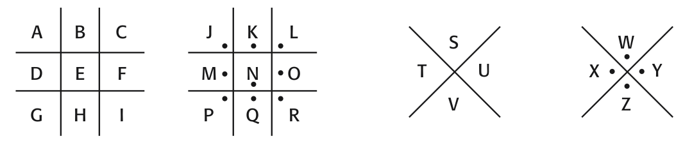
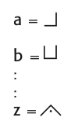

## APPENDIX D The Pigpen Cipher

The monoalphabetic substitution cipher persisted through the centuries in various forms. For example, the pigpen cipher was used by Freemasons in the 1700s to keep their records private. The cipher does not substitute one letter for another; rather, it substitutes each letter for a symbol.

To encrypt a letter, find its position in one of the grids, then skecth that portion of the grid to represent that letter. Hence:

If you know the key, then the pigpen cipher is easy to decipher. If not, then it can be broken by:

