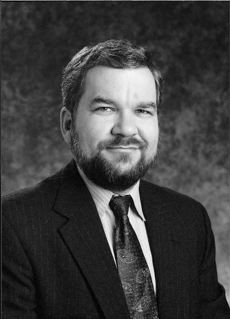

## 第六章 Pretty Good Privacy
隐私的政治，密码学的未来以及不可破译密码的追求

数字信息的交换已经成为了我们社会不可或缺的一部分。每一天，数千万封电子邮件被发送，因特网的存在为数字市场和繁荣的电子商务提供了基础。资金在网络空间流动，据估计，每一天世界上有一半的国内生产总值都是通过环球同业银行金融电讯协会（Society for Worldwide Interbank Financial Telecommunications，SWIFT）网络流转的。支持全民公投的民主国家开始采用在线投票，政府将会越来越频繁地使用因特网来管理国家，诸如提供在线报税服务。毫无疑问，我们处在信息时代，一个联网的世界。

信息时代的成功有赖于其保护在全世界流动信息的能力，而这取决于密码学的能力。密码为信息时代提供了钥匙和锁。两千年来，密码一直只被政府和军队所器重，而如今它也在促成商业交易起着作用，而在明日，普通人使用密码学将仅仅是保护自己的隐私。幸运的是，在信息时代腾飞之初，我们便拥有了强大的密码了。公钥密码学的发展——尤其是 RSA 密码——给予了今天的密码编码者在与密码破译者旷日持久的对抗中以明显的优势。如果 N 值足够大，Eve 将花费不可理喻的时间找到 p 和 q，因此 RSA 加密确实是坚不可摧的。最重要的是，公钥密码学不因任何密钥分发问题而被削弱。简言之，RSA 是保障我们珍贵信息牢不可破的锁。

**图 51** 菲尔·齐默尔曼

然而，密码与其他技术一样，有着其阴暗面。在保护守法公民通信的同时，密码也保护着罪犯和恐怖分子的通信。目前，警方使用电话搭线监听的方式收集有组织犯罪和恐怖主义的证据，并进行打击，但如果罪犯使用了不可破译的密码，电话监听将一无是处。

在二十一世纪，密码学的根本困境在于找到一种方式，它能够让公众和企业使用加密，享受信息时代的益处，而禁止罪犯滥用密码进而逃脱罪行。目前最激烈的争论是关于最佳解决方案的，其中大部分讨论是由菲尔·齐默尔曼（Phil Zimmermann）的事情引发的，他是一位倡导广泛使用强加密的美国密码学家，这吓坏了美国安全专家，威胁到腰缠万贯的国家安全局的有效工作，使他成为主要问询和大陪审团调查的对象。

20 世纪 80 年代末，齐默尔曼——这位长期政治活动家——开始将注意力转向数字革命和加密的必要性上：

> 密码学曾经是一门晦涩难懂的学科，与人们日常生活毫无联系。历史上，密码学一直在军事和外交通信领域有着重要地位。但在信息时代，密码学是一种政治力量，具体说，是关于政府和其人民的力量联系。它与隐私权，言论自由，结社自由，出版自由，免于不合理搜查与扣押以及独处自由有关。

齐默尔曼称，传统通信和数字通信有着本质区别，后者的安全意义更为重要：

> 在过去，政府若是想要侵犯普通公民的隐私，它必须付诸一定的努力，去拦截邮件，用蒸汽打开信封并阅读书面邮件，或者监听电话并尽可能地谈话内容进行文字转录。这与用鱼钩鱼线捕鱼类似，一次只能一条鱼。对于自由和民主来说幸运的是，这类劳动密集型监控在大尺度上并不适用。如今电子邮件逐步取代了传统书面信件，进入寻常百姓家，不再是新鲜事物。和书面信件不同，拦截电子邮件并扫描感兴趣的关键词简直是小儿科。它可以在大尺度上轻松、例行、自动化和悄无声息地完成。它与渔网捕鱼相似——在民主健康的量与质上有着奥威尔式的区别。

普通和电子邮件的区别可以通过想象以下场景阐明：Alice 想要发送她的生日派对邀请函，而没有被邀请的 Eve 想要知道何时何地举办派对。如果 Alice 使用传统方式投递信件，那么对于 Eve 来说拦截邀请函是非常困难的。首先，Eve 不知道 Alice 的邀请函是何处进入邮件系统的，因为 Alice 可以使用城市里的任意邮桶。想要截获邀请函，她只能寄希望于通过某种方式确定 Alice 朋友的住址，并潜入当地分拣办公室。接下来她得手工检查每封邮件。要是她设法找出了 Alice 的信件，她必须使用蒸汽打开它，查看她想要的信息。她还要依原样复原，以避免任何篡改的怀疑。

作为对比，如果 Alice 用电子邮件发送邀请函，Eve 的任务就相当容易了。在消息离开 Alice 计算机后，它们便前往本地服务器，一个因特网的主要进入点；如果 Eve 足够聪明，她无需离开家便可入侵本地服务器。邀请函会带有 Alice 电子邮箱地址，设置一个含有 Alice 地址的电子过滤器就行了。由于找到的邀请函上没有信封，可以直接阅读了。此外，邀请函不会显示任何在途中被拦截的迹象。Alice 一举一动都变的明显。然而，有一种方法可以阻止 Eve 阅读 Alice 电子邮件——那就是加密。

每一天世界上大多数已发送的电子邮件都是容易受到拦截的，因为多数人不进行加密。齐默尔曼说，密码学家有责任鼓励人们使用加密，从而保护个体的隐私：

> 未来的政府可能会拥有一个专门为监控优化的技术设施，通过它，政府可以观察政治异议的运动，每一笔金融交易，每一次通讯，电子邮件的每一比特，每一支通话。万物皆可过滤和扫描，并用语音识别技术进行识别和文字转录。现在是时候让密码学走出特工和军队的阴影，与阳光中的我们拥抱了。

1977 年 RSA 被发明时，它为老大哥场景提供了理论上的解毒剂，因为个人可以自行生成公钥和私钥，收发完全安全的消息了。但是在实际操作过程中存在一个大问题——RSA 加密过程需要大量计算资源。在 80 年代，只有政府，军队和大型企业才拥有足够强大的计算机来运行 RSA 密码系统。毫不奇怪，RSA Data Security, Inc. 这家商业化运作 RSA 的公司，只考虑为这些市场开发其密码产品。

而齐默尔曼认为每个人都应该得到由 RSA 密码提供的隐私，它致力为大众开发一款 RSA 密码产品。他打算凭借自己的计算机科学背景，设计出一款他认为经济高效的产品，而不超出个人计算机的能力。他也想让他的 RSA 版本有着特别友好的界面，用户无需成为密码学专家即可使用它。他把项目称之为 Pretty Good Privacy， 缩写 PGP。这个名字的灵感来自 Ralph 的 Pretty Good Groceries，是齐默尔曼最喜爱电台节目《牧场之家好作伴》（Garrison Keillor’s A Prairie Home Companion）的赞助商。

在 80 年代晚期，齐默尔曼在科罗拉多州博尔德的家中逐步将它打成软件包。他的主要目标是加快 RSA 加密的速度。原先 Alice 想要使用 RSA 加密给 Bob 的消息，她需要查找他的公钥，对消息使用 RSA 单向函数。反过来，Bob 使用他的私钥执行 RSA 单向函数逆过程得以解密密文。这两个过程需要大量的数学运算，如果消息足够长，加密和解密可以在个人计算机上持续数分钟之久。如果 Alice 每天发送一百条消息，她将难以忍受每条消息加密的时间。为了加快加密和解密的过程，齐默尔曼使用了一个巧妙的技巧，他将 RSA 非对称加密和传统对称加密结合使用。传统对称加密可以和非对称加密一样安全，而且它性能更佳，但对称加密存在密钥分发问题；密钥必须从发送者安全地传输到接收者。这便是 RSA 用武之地，RSA 能够用来加密对称密钥。

齐默尔曼描述了以下场景。如果 Alice 想要给 Bob 发送加密消息，她先使用对称密码加密消息。齐默尔曼建议使用被称为 IDEA 的对称密码。要使用  IDEA 加密，Alice 需要取密钥，但 Alice 必须通过某种方式把密钥给 Bob，Bob才得以解密消息。Alice 通过查找 Bob 的 RSA 公钥，并用它加密 IDEA 密钥，克服这一难题。此时 Alice 给 Bob 发送了两件东西：用 IDEA对称密码加密的消息和用 RSA 非对称密码加密的 IDEA 密钥。在另一头，Bob 使用他的 RSA 私钥解密得到 IDEA 密钥，接着用 IDEA 密钥解密消息。这么做似乎有些迂回， 其优势在于，所包含大部分信息被更快速的对称密码加密，而相对较少的信息——只有 IDEA 密钥——被更慢的非对称密码加密。齐默尔曼计划将 RSA 和 IDEA 整合进 PGP 产品，而用户友好界面意味着用户不必知晓正在发生的细枝末节。

1991 年夏，齐默尔曼正将 PGP 打磨成完善的产品，剩下的唯一问题是：美国参议院 1991 年综合反犯罪法案（the U.S. Senate’s 1991 omnibus anticrime bill），它包含以下条款：“国会的意见是，电子通信服务提供商和电子通信服务设备制造商应当确保允许政府在经过适当的法律授权情况下获取语音、数据以及其他通信的明文内容。”参议院担心像蜂窝电话的数字技术的发展可能会阻碍执法者进行有效的电话监听。然而除了强迫公司保证电话监听的可行性，该法案似乎也威胁了所有安全加密的形式。

在 RSA Data Security，通信业和公民自由组织的共同努力下，该条款被废除，但达成的共识只不过是临时缓刑令。齐默尔曼担心政府会迟早再度立法禁止诸如 PGP 这类加密。他一直想销售 PGP，但现在他重新考虑了他的选项。他决定不再等待 PGP 是否会被政府禁止，重要的是，他要在事情无法挽回前让所有人都能够使用它。1991 年 6 月，他激进地要求一位朋友将 PGP 发布在 Usenet 公告板上。PGP 只是一款软件，任何人都可以在公告版上免费下载它。现在 PGP 犹如因特网上的一匹脱缰野马。

[...]

### 密码学的未来

1996 年，在经过三年的调查后，美国司法部长办公室（the U.S. attorney general’s office）放弃了对齐默尔曼一案的起诉。当局意识到它已为时已晚——PGP 已逃入因特网，起诉齐默尔曼对此于事无补。此外还有一个问题，各大学院支持着齐默尔曼，比如麻省理工学院出版社将 PGP 发表在 600 页的书中。这本书在世界各地发行，因此起诉齐默尔曼将意味着起诉麻省理工学院出版社。齐默尔曼有可能不被定罪，政府也不热衷于起诉——审判带来的恐怕不过是一场有关隐私权的尴尬宪法辩论，从而激起公众对广泛使用加密的认同。

最终，PGP 成为了合法的产品，齐默尔曼也恢复了自由身。这次调查使得他成为密码学运动的领袖。世界上任何一位营销主管势必会羡慕齐默尔曼一案带给 PGP 的名声和免费宣传。1997 年底，齐默尔曼将 PGP 卖给了 Network Associates，而他成为了他们的资深伙伴。即便现在 PGP 卖给了商业公司，如果不用作商业用途，个人仍然可以免费使用。换言之，仅仅希望实践自己隐私权的人仍然可以下载 PGP，而无需为此付费。

你要是想获得 PGP 的副本，有许多因特网网站提供它的下载，你应当相当容易能够找到。其中最可靠的大概是 PGP 国际主页 [www.pgpi.com/](http://www.pgpi.com/)，在上面你可以下载到美国版和国际版 PGP。这一点上，我不想做任何担保——如果你想选择安装 PGP，你得自己检查你的计算机能够运行它，软件未被病毒感染等等。此外，你应当检查你所在的国家允许使用强加密。

时至今日，公钥密码学的发明以及使用强密码的政治争论仍萦绕耳畔。很明显，密码编码者（cryptographers）赢得了这场信息战。齐默尔曼说，我们处在密码学的黄金时期：“在现代密码学中，发明远远超出密码分析（cryptanalysis）已知形式范畴的密码是可行的。我认为这种情况将一直保持下去。”国家安全局副局长威廉·克罗威尔（William Crowell）赞同齐默尔曼的观点：“如果世界上所有的个人计算机加在一起——大概有 2.6 亿台计算机——破译一条由PGP加密的消息，这需要花费 1200 万倍于宇宙年龄的时间。”

然而先前的经验告诉我们，每一种被称为不可破译的密码迟早会屈服于密码分析。维热纳尔密码（The Vigenère cipher）被称为不可破译的密码，但巴比奇（Babbage）破译了它；Enigma 被认为是毫无漏洞的，但波兰人发现了它的弱点。所以，是密码分析师（cryptanalysts）正迎来下一次的突破，还是齐默尔曼是对的？预测任何技术的发展总是充满风险的，密码学尤其如此。我们不但要预测将来会发现什么，而且还要猜测目前已经发现什么。詹姆斯·埃利斯（James Ellis）和 GCHQ 的故事警示着我们，一些重大突破可能就隐藏在政府情报部门之后。

但如果 RSA 被破译了，安全加密的希望已经存在。1984年，位于纽约的 IBM 托马斯·J·沃森实验室研究员查尔斯·贝内特（Charles Bennett）提出了量子密码学（quantum cryptography）的想法。量子密码学是完全无法破译的密码系统，它是基于量子物理学（quantum physics），后者是解释宇宙在最基本层面运作方式的理论。贝内特的想法在量子物理学中属于被称为海森堡不确定性原理（Heisenberg’s uncertainty principle）的层面，该定律说不可能以极高的精度测量某个物体，因为测量行为本身会改变被测量的物体。

举例说，我要测量手的长度，首先我得看到它，因此我必须有光源（无论是日光还是灯光）。光波会先抵达手，然后反射到眼睛，但这有两个问题。其一，光的波长限制了任何尺度测量的精度。其二，光波对我的手的影响会返过来改变光波本身，就像海波拍打着峭壁一样。与海波相比，光波的影响微乎其微，在日常生活中无法被感知。因此工程师试图高精度地对螺栓进行测量，而测量仪器的质量远远早于他进行实验时就被不确定性原理所限制了。然而，在微观层面上不确定性原理是个大问题。在质子和电子的尺度，测量的不精确会相当于被测量物体的大小。光的影响会显著改变被观测的细小的粒子。

贝内特提出使用基本粒子发送信息的想法，如果 Eve 尝试截获或测量粒子，她会错误测量并改变它们。简言之，Eve 不可能精确地截获通信，甚至她尝试做了，她的影响对于 Alice 和 Bob 来说很明显，他们会知道她在监听并中断通信。

你可能会问：Alice 给 Bob 发送了一条量子密码学消息，根据不确定性原理 Eve 无法阅读它，那 Bob 怎么阅读它？他为什么不受到不确定性原理的影响？解决方案是 Bob 需要发送一条密文用于确认他收到的内容，因为 Alice 知道她发给 Bob 的原始内容，第二封消息用于删除 Alice 和 Bob 之间的错误部分，而把 Eve 留在阴暗中。在两次沟通结束后，Alice 和 Bob 便可以愉快地进行完全安全的通信了。

**图 52** 查尔斯·贝内特

量子密码学的整个想法听起来很荒谬，但 1988 年贝内特成功证明了在两台距离 12 英寸计算机之间安全通信的可行性。长距离消息仍有困难，因为消息是由单个粒子传递的，远距离传输可能会破坏它们。因此在贝内特实验之后，挑战便是在实用距离上建立可运行的量子密码学系统。1995 年，瑞士日内瓦大学（University of Geneva）的研究人员成功实现从日内瓦到尼翁（Nyon）的量子密码学通信，距离 14 英里有余。

现在，安全专家想知道量子密码学成为实用技术还需要多久。此时此刻，使用量子密码学并没有太大优势，RSA 密码已经给予我们足够不可破译的加密了。但如果密码破译者发现 RSA 的漏洞，那么量子密码学就变得必要。因此比赛还在继续。瑞士的实验已经证明了，在城市里的金融机构之间建立安全通信的可行性。它确实可以在白宫和五角大楼之间建立量子密码链路（quantum cryptography link），它很可能已经存在了。

量子密码学将标志着密码编码者（codemakers）和密码破译者（codebreakers）战争的结束，密码编码者胜出，因为量子密码学是真正不可破译的密码系统。根据前面类似的说法，这似乎是一个言不副实的断言。在过去两千年里的不同时期，密码编码者相信单字母密码（the monoalphabetic cipher），多表密码（the polyalphabetic cipher）以及像 Enigma 的机器密码都是不可破译的。在这些例子中的密码编码者最终被证明是错的，因为他们断言是建立在密码复杂性的基础之上，而非同时期密码分析师的才智和技术。我们已经看到了，密码分析师不可避免地对这些密码各个击破，开发出新技术破解它们。

然而，对量子密码学的断言是安全的，它与先前的断言截然不同。量子密码学不仅是不可破译，而且绝对不可破译。量子论是物理学史上最成功的理论，它意味着 Eve 不能精确地拦截 Alice 和 Bob 之间的任何通信。Eve 无法做到 Alice 和 Bob 不被警告的情况下，尝试拦截任何通信，如果可以，这将证明量子论是存在漏洞的。这对物理学家来说是一场灾难——他们将被迫重新思考他们对宇宙在最基本层面运作方式的理解。

如果量子密码学能够实现长距离运作，那么密码的演化便会停止。对隐私的追求也到了尽头。这项技术将会被用于保证政府、军队、商业以及公众的安全通信。剩下的唯一问题是，政府是否会允许我们使用这项技术了。